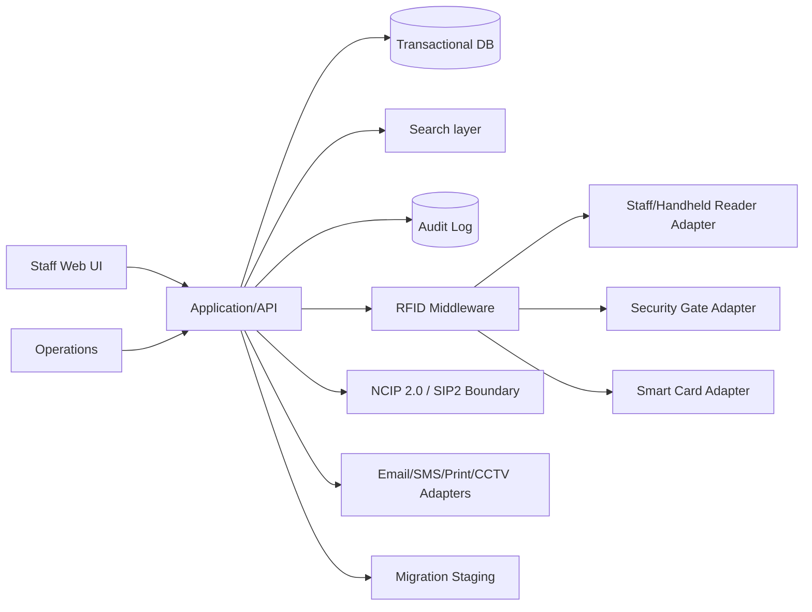

# Architecture Package (D2)

## Context

The platform sits between library staff/users, library workflows, RFID devices, an existing ILMS and provider-neutral services. Production endpoints were not supplied, so external integrations are represented by contracts and deterministic mocks.

## Layer boundaries

1. **User layer** — staff web interface, search/OPAC, dashboard and administration.
2. **Application layer** — catalogue, member, circulation, fines/restrictions, inventory, notifications, reporting and RBAC.
3. **RFID middleware** — device-neutral commands/events.
4. **Interoperability** — NCIP 2.0 adapter boundary and SIP2 boundary.
5. **Data layer** — transactional data, audit events, migration staging and backup/restore.
6. **Integration layer** — provider-neutral email/SMS/print/CCTV and external ILMS adapters.
7. **Operations layer** — configuration, secrets, logs, health checks, updates, backups and rollback.

## Design decisions

- FastAPI + SQLAlchemy provides a small, testable service boundary suitable for an offline prototype.
- PostgreSQL is the containerized deployment target; SQLite is the zero-dependency local/demo target.
- Adapter interfaces isolate unavailable hardware/vendor systems.
- Business logic is separated from HTTP routes so the same services can be called by tests, jobs or future device gateways.
- Configuration is environment based; no secrets are committed.
- Audit logging is persisted for administrative and circulation actions.

## Data integrity strategy

- Back up before integration/migration.
- Migrations first validate into staging.
- Invalid and duplicate rows are rejected before commit.
- Import is transactional.
- Failed imports are rolled back.
- Restore procedures are documented.

## Production hardening backlog

Before a live institutional deployment: integrate the actual ILMS contract, vendor SDKs, real identity provider, enterprise secrets store, TLS certificates, database HA/backup policy, observability stack, penetration testing, accessibility review, load testing against real volumes, and formal certification where required.

## Search and cataloguing extensions

The prototype includes OPAC and virtual-bookshelf endpoints, acquisition and serial-issue records, and a search-document boundary. The current local fallback uses indexed application fields/LIKE semantics so the package remains portable offline; a PostgreSQL deployment can replace that implementation with `tsvector` + GIN without changing the external API.
